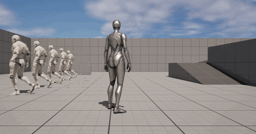

# GPUBased_Emotional_MotionMatching
Han Wang & Xiaoyue Ma

## Milestone Slides
 [Milestone1 Slide](https://docs.google.com/presentation/d/1ReOL6aRipmgVvq1oI5TzAEBSmwE4okE5VBqne8QOwO0/edit?usp=sharing)
 
 [Milestone2 Slide](https://docs.google.com/presentation/d/10Vmtje1TYG2by99pjaSxHmJE1uDU_mSqM6aJXk8oVE4/edit?usp=sharing)
 
 [Milestone3 Slide](https://docs.google.com/presentation/d/1LE8DsNWHqecslTkHEJP5CkqP78D5CWmJ1i31S9SzzZw/edit?usp=sharing)

## Overview Output Video

https://github.com/CaballoMa/GPUBased_Emotional_MotionMatching/assets/112833135/c4f82d19-fcff-48bb-b192-62bb7926bc35

## Motion Matching Introduction

Motion matching is a data-driven animation technique used predominantly in video games and virtual reality to achieve lifelike character movements. Departing from traditional handcrafted animations, motion matching relies on a vast database of motion capture data. In real-time, the system queries and selects relevant motion data based on the current state and user input, seamlessly blending and adapting animations for a more realistic and dynamic appearance. This approach enhances adaptability to environmental changes, reduces repetitiveness, and contributes to a more immersive and engaging user experience by creating responsive and authentic character animations.

Traditional Motion matching is CPU-based, and usually only runs on the main character. Our approach uses a GPU-based method to speed up the process and make it more suitable for multi-character motion-matching conditions.

## Working Flow

Delving into our operational methodology, our primary objective lies in the transformation of the CPU-based linear motion matching calculation process into a more efficient and scalable counterpart leveraging GPUs.  This strategic evolution is grounded in the recognition that concurrently calculating multiple instances of the motion matching process on a CPU follows a linear trajectory, resulting in a proportional increase in calculation speed due to the sequential nature of motion-matching data computation.  

This inherent limitation is circumvented by migrating the computational workload to GPUs, where the parallel processing architecture enables the simultaneous execution of diverse motion matching processes.  This concurrent computation not only mitigates the linear increase in processing time but also substantially decreases it, rendering the overall processing time conducive to achieving real-time performance.  

The adoption of GPU parallelism emerges as a pivotal enhancement, ensuring not only computational efficiency but also the seamless execution of multi-motion matching operations, thereby contributing to the creation of responsive and dynamic interactive environments.

Our approach is based on UE5.3, an experimental compute shader. Based on the idea of the source code and the paper, we built a plugin that created a custom node. As shown in the graph, we implemented the GPU-based parallel calculation mainly using the compute shader. 

Instead of using a for loop to iter through the poses to compute the error(cost), we collected the data and then used float buffers to transfer the data in and out of the GPU. Also, the game thread will not wait for the render thread to finish the calculation, it will use the data from the previous 3 frames to decide which pose will be played. After the GPU side finishes the calculation, we will store the data used for future motion matching. This process will be parallel to the main game thread and won't affect the current frame rate.

## Optimization Process

### 1. CPU - GPU

### 2. Compute Shader calculation method

### 3. Waiting current frame - using previous frame

## Performance Analysis

Still working on it.

## Reference

[GPU-based Motion Matching for Crowds in the Unreal Engine](https://dl.acm.org/doi/10.1145/3415264.3425474)

[UE compute shader reference 1](https://dev.epicgames.com/community/learning/tutorials/WkwJ/unreal-engine-simple-compute-shader-with-cpu-readback)

[UE compute shader reference 2](https://zhuanlan.zhihu.com/p/608724638)

[UE compute shader reference 3](https://www.notion.so/Compute-Shader-651791c5045c4521ae3f293e41a4cc0a)

[UE analysis tool](https://wiry-desk-002.notion.site/UE5-UE5-61b945c2b40e463dbc83459628e1ce5f)

[UE analysis tool2](https://www.bilibili.com/video/BV1kb411o7DU/?vd_source=253f5f84a943bc901c96d75159e98107)

 
 
