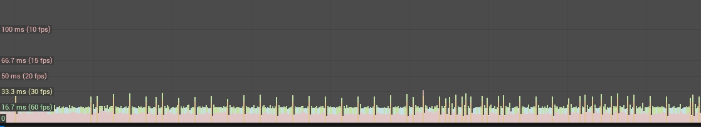
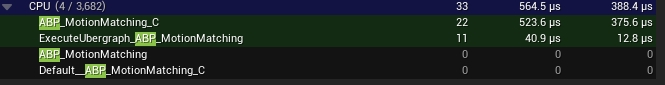

# GPUBased_Emotional_MotionMatching

## Overview Output

### Presentation

[GPU-based NPCs’ Motion Matching with Personalized Animation](https://docs.google.com/presentation/d/1bqu9WO6MdaSDJUJ0BupnrZNoLDoQ_u2QffSNNol0kBY/edit?usp=sharing)

## Motion Matching Introduction

Motion matching is a data-driven animation technique used predominantly in video games and virtual reality to achieve lifelike character movements. Departing from traditional handcrafted animations, motion matching relies on a vast database of motion capture data. In real-time, the system queries and selects relevant motion data based on the current state and user input, seamlessly blending and adapting animations for a more realistic and dynamic appearance. This approach enhances adaptability to environmental changes, reduces repetitiveness, and contributes to a more immersive and engaging user experience by creating responsive and authentic character animations.

Traditional Motion matching is CPU-based, and usually only runs on the main character. Our approach uses a GPU-based method to speed up the process and make it more suitable for multi-character motion-matching conditions.

## UE5.3 Motion Matching Process Framework

;

## How To Use

#### 1. Download the /plugin file in this repository
#### 2. Drag it into your project/plugin
#### 3. Build the motion matching database(can also buy from UE marketplace)

#### 4. Build the config File

#### 5. Build the Animation blueprint using our custom node.

#### 6. Run motion Matching
just run your character

#### 7. Other: database importer

1. drag the Python file from the retarget_helper file to Maya main window. You'll see the plugin pop up. Build the Human IK for both skeletons.

2. As shown in the graph, click on the skeleton and add it to the plugin.
   
3. Select the animation files& output folder in the selection window.
 
4. Click "link start" and get the retargeted animations.

## Working Flow

Delving into our operational methodology, our primary objective lies in the transformation of the CPU-based linear motion-matching calculation process into a more efficient and scalable counterpart leveraging GPUs.  This strategic evolution is grounded in the recognition that concurrently calculating multiple instances of the motion-matching process on a CPU follows a linear trajectory, resulting in a proportional increase in calculation speed due to the sequential nature of motion-matching data computation.  

This inherent limitation is circumvented by migrating the computational workload to GPUs, where the parallel processing architecture enables the simultaneous execution of diverse motion-matching processes.  This concurrent computation mitigates the linear increase in processing time and substantially decreases it, rendering the overall processing time conducive to achieving real-time performance.  

The adoption of GPU parallelism emerges as a pivotal enhancement, ensuring not only computational efficiency but also the seamless execution of multi-motion matching operations, thereby contributing to the creation of responsive and dynamic interactive environments.

Our approach is based on UE5.3, an experimental motion matching. Based on the idea of the source code and the paper, we built a plugin that created a custom node. As shown in the graph, we implemented the GPU-based parallel calculation mainly using the compute shader. 

Instead of using a for loop to iter through the poses to compute the error(cost), we collected the data and then used float buffers to transfer the data in and out of the GPU. Also, the game thread will not wait for the render thread to finish the calculation, it will use the data from the previous 3 frames to decide which pose will be played. After the GPU side finishes the calculation, we will store the data used for future motion matching. This process will be parallel to the main game thread and won't affect the current frame rate.

## Performance Analysis

### 1. CPU PERFORMANCE

#### 1 character

#### 10 characters

#### 100 characters

### 2. GPU PERFORMANCE

#### 1 character

#### 10 characters

#### 100 characters

Based on the above analysis, it is easy to see that GPU performance is better than the traditional CPU way. There is one thing we need to mention, the frame rate and function time cost might change a lot corresponding to the time condition. It might not be precise, but we tried to pick up the average condition.  Firstly, in the one character's case, it seems that there is no difference between the CPU case and GPU case. It is because the time consumed is so low, that our insight tool might not be able to give really precise results. In our opinion, the GPU option might have a faster speed though we cannot actually see it.

The difference becomes large when we run 10-character motion matching conditions. The CPU performance shows a large drop-down. It is because though the UE engine uses a multi-thread method to speed up the different character's tasks, the task thread amount is limited. There are also CPU working rules that force the current game thread to wait until everything is finished. However, our GPU motion-matching workflow is different. The only thing we need to do is dispatch the task to the GPU and then continue the game thread without waiting for the GPU's response. Our work shows a 50% increase in calculation speed in 10-character cases and even more in 100-character cases. The user can feel a great improvement in frame rate while using our motion-matching method when a large number of characters use motion-matching.

People might feel that the compute shader improvement might seem lower than expected. This is because the parallel calculation is rather easy compared to the lots of rendering tasks. There aren't lots of matrix calculations like rendering. Thus, the time of sending the data to GPU and returning them might balance the time we saved in parallel calculation. Our group noticed this and used lots of methods to make our work show an obvious improvement in running large-scale characters. 

### The optimization we've done

#### 1. Compute shader data organization

we put the database data and trajectory data into the buffer to the gpu, and compare the compute shader result in the cpu to get the best pose.

####  2. Waiting current frame - using the previous frame

#### 3. Database upgrade

Personalized NPC requires diff animation database to select based on current state.
(Our original intention was to choose different emotional animations, but because Motionmatching requires motion capture data and online resources are limited, we temporarily verified our implementation with three types of motion libraries.)

Then we implemented the process that character can choose diff database to search based on their current state.

#### 4. Further frame prediction

If we don't wait for the cpu it will cause the gpu's Output to lag behind the animation of the current frame, so it needs to be calculated from data sampled in the future to reduce the lag error.

#### 5. Time dimension denoize

Also, to reduce dispatch stress, we distribute each dispatch into four buffer and apply prediction on each of them.

#### Result for prediction denoize

As you can see, the character animation without predicting is inconsistent, and you can see that the character's footsteps repeat and cross over. The right one with prediction implement works fine.

## Other than performance optimization 

### Database building support

Since we need to have different databases for our characters, a big problem shows up: we don't have this much animation data. Additionally, most of the data we get can not fit our skeleton. Thus, we need to use MAYA human IK to retarget them. However, there are hundreds of animation data for each database, it is even impossible to manually retarget the animation. Thus, we wrote a Maya plugin to solve this large-scale retarget problem. The way to use it was written in the above how-to-use part.

## Reference

[GPU-based Motion Matching for Crowds in the Unreal Engine](https://dl.acm.org/doi/10.1145/3415264.3425474)

[UE compute shader reference 1](https://dev.epicgames.com/community/learning/tutorials/WkwJ/unreal-engine-simple-compute-shader-with-cpu-readback)

[UE compute shader reference 2](https://zhuanlan.zhihu.com/p/608724638)

[UE compute shader reference 3](https://www.notion.so/Compute-Shader-651791c5045c4521ae3f293e41a4cc0a)

[UE analysis tool](https://wiry-desk-002.notion.site/UE5-UE5-61b945c2b40e463dbc83459628e1ce5f)

[UE analysis tool2](https://www.bilibili.com/video/BV1kb411o7DU/?vd_source=253f5f84a943bc901c96d75159e98107)

 
 
